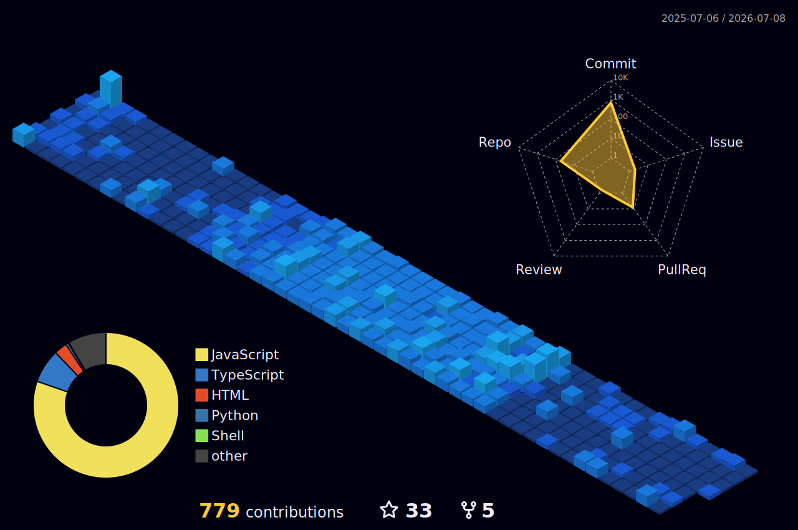

<h1 align="center">


<h3 align="center">Web & App Developer | Proficient in Python, JavaScript, and Cloud Technologies</h3>


[](https://peerlist.io/ananyahegde)
<br>
> [!NOTE]
> <code>➜ 🔭 I’m currently working on a **Tech Products :)** </code><br>
> <br>
> <code>➜ 🌱 I’m currently learning **JavaScript, Python** </code><br>
> <br>
> <code>➜ 📝 I regularly write articles on - **[Medium](https://medium.com/@ananyavhegde2001)** </code><br>
> <br>
> <code>➜ 💬 Ask me about **Front-End Development** </code><br>
> <br>
> <code>➜ 📄 Know about my experiences - **[CV](https://ananya-cv.vercel.app)** </code>


```bash
   ___                                    _   _                _      
  / _ \                                  | | | |              | |     
 / /_\ \_ __   __ _ _ __  _   _  __ _    | |_| | ___  __ _  __| | ___ 
 |  _  | '_ \ / _` | '_ \| | | |/ _` |   |  _  |/ _ \/ _` |/ _` |/ _ \
 | | | | | | | (_| | | | | |_| | (_| |   | | | |  __/ (_| | (_| |  __/
 \_| |_/_| |_|\__,_|_| |_|\__, |\__,_    \_| |_/\___|\__, |\__,_|\___|
                           __/ |                      __/ |            
                          |___/                      |___/

fn main() {
    let _name = "Ananya V Hegde";
    let _education = "MCA";

    let _location = "Bengaluru, Karnataka";
    let _contact = "ananyavhegde2001@gmail.com";
}

$ cat about.txt
developer fascinated by Mern, open source, and research.
building, experimenting, and learning

$ logout
```

<!-- GITHUBWALLPAPER:START -->
<picture>
  <source media="(prefers-color-scheme: dark)" srcset="https://pub-98d2cd4dac4e4a9d899b190ba95f3ace.r2.dev/cards/n95o6ryv47hk8hhcael1hts0-dark.svg?v=1784380269388">
  <source media="(prefers-color-scheme: light)" srcset="https://pub-98d2cd4dac4e4a9d899b190ba95f3ace.r2.dev/cards/n95o6ryv47hk8hhcael1hts0-light.svg?v=1784380269388">
  
</picture>
<!-- GITHUBWALLPAPER:END -->

<br>
<picture>
  <source media="(prefers-color-scheme: dark)" srcset="https://raw.githubusercontent.com/isakshamkumar/isakshamkumar/output/pacman-contribution-graph-dark.svg">
  
</picture>
<!--  -->
<h2 align="left">🤝 Find Me On:</h2>

[](mailto:ananyavhegde2001@gmail.com) [](https://www.linkedin.com/in/ananyahegde-/) [](https://ananyavhegde.vercel.app/) [](https://peerlist.io/ananyahegde) [](https://medium.com/@ananyavhegde2001) [](https://leetcode.com/u/AnanyaCodeForge/) [](https://www.hackerrank.com/profile/ananyavhegde2001) [](https://www.kaggle.com/ananyavhegde)
<br>

<p align="center">
  <a href="https://next.ossinsight.io/widgets/official/compose-activity-trends/thumbnail.png?repo_id=877310500&image_size=auto" target="_blank">
    <picture>
      <source
        media="(prefers-color-scheme: dark)"
        srcset="https://next.ossinsight.io/widgets/official/compose-activity-trends/thumbnail.png?repo_id=877310500&image_size=auto&color_scheme=dark"
      />
      
    </picture>
  </a>
</p>

<h2 align="left">🛠 Languages and Tools:</h2>


<div align="center">
<!--  -->
<!--  --> 
<table align="center">
<tr>
<td align="center">

</td>

<td align="center">

</td>

<td align="center">

</td>
</tr>
</table>

<div align="center">
  
</div>

<!-- 
</div> -->
<p align="center">
  <!--  -->
  

    
</p>
</div> 

<h2>✍️ Random Dev Quote</h2>

<p align="center">
  
</p>

<h2>📈 GitHub Contribution Graph:</h2>

<div align="center">

</div>

<!-- 	-->


## 🏆 LeetCode Achievements
<div align="center">
<p align="center">
<table>
<tr>
<td align="center">
<a href="https://leetcode.com/medal/?showImg=0&id=10057983&isLevel=false">

</a>
<br/>
🔥 <b>50 Days Coding Badge</b>
</td>
<td align="center">
<a href="https://leetcode.com/medal/?showImg=0&id=10412600&isLevel=false">

</a>
<br/>
🚀 <b>100 Days Coding Badge</b>
</td>
</tr>
</table>
</p>
</div>

<h2>🌊 Flow with the waves, Bright vibes incoming! -Ananya</h2>
<h3 align="center">
    
</h3>

<!--  -->
